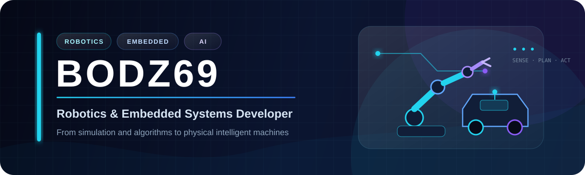

  

<b>Robotics · Embedded Systems · Autonomous Navigation · Computer Vision</b>

## Featured projects

  
  

  
  

## Core tools

  
  
  
  
  
  
  
  

I focus on complete systems connecting **perception, localization, planning, embedded control and physical hardware**.

  

