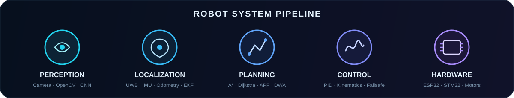

<p align="center">
  
</p>

<p align="center">
  <a href="https://github.com/bodz69?tab=followers">
    
  </a>
  <a href="https://github.com/bodz69?tab=repositories">
    
  </a>
  
</p>

<p align="center">
  <a href="https://git.io/typing-svg">
    
  </a>
</p>

---

## About me

<table>
<tr>
<td width="58%" valign="top">

I develop practical robotic systems by connecting **mechanical design, embedded control, localization, navigation and computer vision**.

- 🤖 Mobile robots, AGVs and robot-arm simulations
- 📡 UWB, wheel odometry, IMU and Kalman/EKF sensor fusion
- ⚙️ ESP32/STM32 control, telemetry, CRC and failsafe logic
- 🧭 Path planning, obstacle avoidance and multi-robot coordination
- 👁️ OpenCV and deep learning for real-world recognition
- 🛠️ A strong focus on moving from simulation to working hardware

</td>
<td width="42%" valign="top">

### Engineering approach

```text
Define the problem
        ↓
Model and simulate
        ↓
Build the controller
        ↓
Integrate hardware
        ↓
Measure and improve
```

</td>
</tr>
</table>

## System architecture

<p align="center">
  
</p>

## Technology stack

<p align="center">
  
  
  
  
  
  
  
  
</p>

<p align="center">
  
  
  
  
  
  
  
</p>

## Featured engineering projects

<p align="center">
  <a href="https://github.com/bodz69/restaurant-robot-algorithm-lab">
    
  </a>
  <a href="https://github.com/bodz69/uwb-mecanum-agv">
    
  </a>
</p>

<p align="center">
  <a href="https://github.com/bodz69/esp32-stm32-remote-control">
    
  </a>
  <a href="https://github.com/bodz69/6dof-robot-arm-simscape">
    
  </a>
</p>

<p align="center">
  <a href="https://github.com/bodz69/real-world-digit-recognition">
    
  </a>
</p>

## GitHub analytics

<p align="center">
  
  
</p>

<p align="center">
  
</p>

## Contribution journey

<p align="center">
  <picture>
    <source media="(prefers-color-scheme: dark)" srcset="https://raw.githubusercontent.com/bodz69/bodz69/output/github-contribution-grid-snake-dark.svg"/>
    <source media="(prefers-color-scheme: light)" srcset="https://raw.githubusercontent.com/bodz69/bodz69/output/github-contribution-grid-snake.svg"/>
    
  </picture>
</p>

---

<p align="center">
  <b>Building systems that sense, understand, decide and act.</b>
</p>

<p align="center">
  <a href="https://github.com/bodz69">
    
  </a>
</p>
