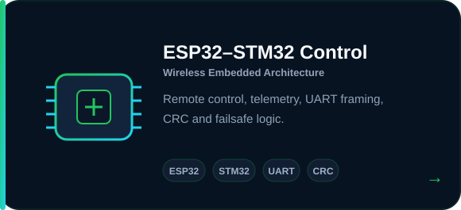
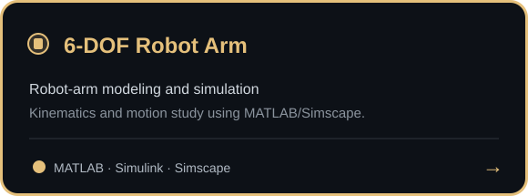
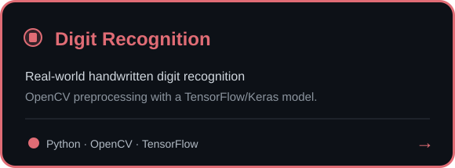

# WELCOME TO MY PAGE 👋

I am interested in **robotics, embedded systems, autonomous navigation and computer vision**.  
My projects focus on turning algorithms and simulations into practical hardware systems.

### 📫 How to reach me

---

## 🚀 Selected projects

  
  

  
  

---

## 📊 GitHub activity

  

